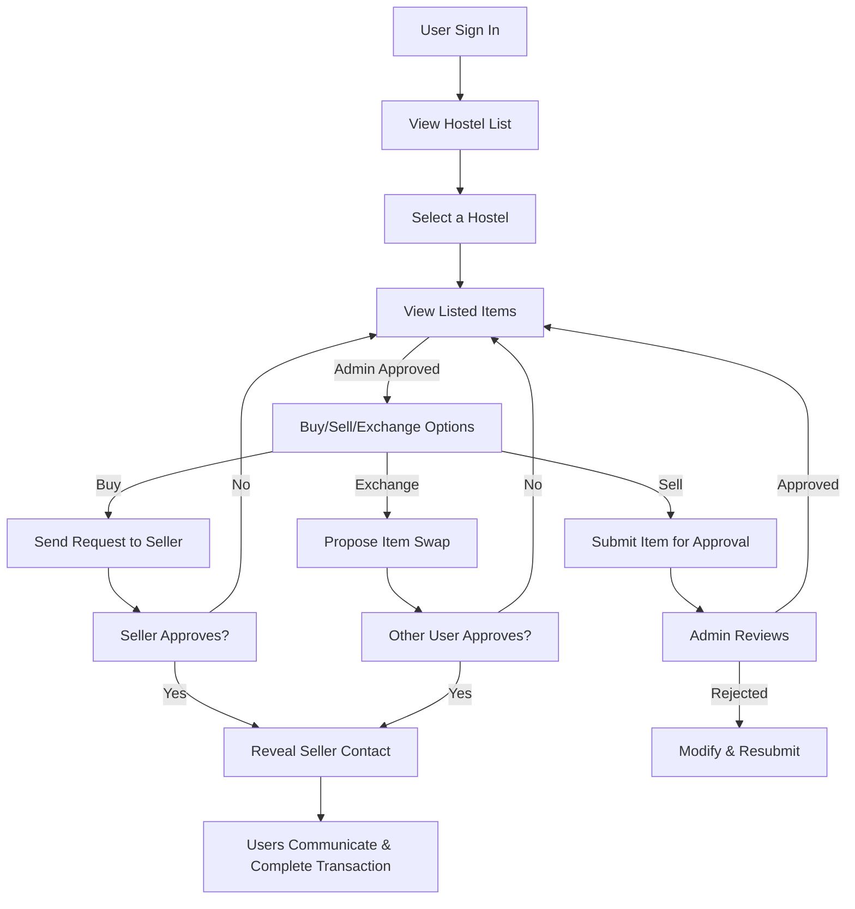

# OpenEx

# OpenEx System Flow

## **Overview**
OpenEx is a web app designed to facilitate buying, selling, and exchanging goods among students in an institute. The platform provides a way for students to contact each other but does not handle transactions directly.

## **System Flow**
1. **User Authentication**  
   - Users sign in to access the platform.

2. **Hostel Listings**  
   - After logging in, users see a list of hostels.  
   - Clicking on a hostel displays the available items.

3. **Product Listings**  
   - The admin pre-filters and approves items for visibility.  
   - Users see options to **Buy**, **Sell**, or **Exchange**.

4. **Transaction Process**
   - **Buy**: Sends a request to the seller. If the seller approves, buyer details are shared.  
   - **Sell**: Users list items for sale, awaiting admin approval.  
   - **Exchange**: Users can propose item swaps, following the same approval process.  

5. **Communication & Finalization**
   - Once both parties approve, contact details are revealed.  
   - Users arrange transactions on their own terms.

---

## **Flow Diagram**

Logo Examples : 

